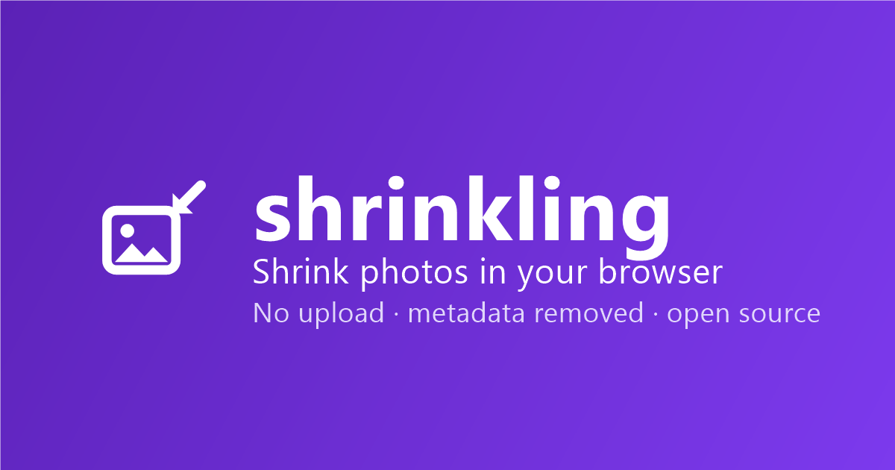

# shrinkling



**➡️ Ausprobieren: [dennismit2n.github.io/shrinkling](https://dennismit2n.github.io/shrinkling/)** &nbsp;·&nbsp; 🇬🇧 [English version of this page](README.md)

Fotos direkt im Browser verkleinern. Bilder hineinziehen, Ziel wählen („E-Mail — max. 2 MB", „Bewerbungsportal — max. 1 MB", …), fertige Dateien herunterladen. Kein Upload, kein Server, kein Konto — deine Fotos verlassen nie dein Gerät.

## Funktionen

- 🎯 **Ein-Klick-Presets** — E-Mail (2 MB), Bewerbungsportale (1 MB), Kleinanzeigen (1920 px), Web (WebP) — plus freie Einstellungen für KB/MB, Pixel, Format und Qualität
- 📦 **Stapelverarbeitung** — viele Fotos auf einmal hineinziehen, alle zusammen als ZIP herunterladen
- 🕵️ **Metadaten entfernt** — GPS-Standort, Kameramodell und Aufnahmezeit werden automatisch gelöscht
- 🖼️ **JPEG, PNG, WebP** — intelligente Zielgrößen-Suche; Warnung, bevor Transparenz verloren ginge (HEIC funktioniert in Safari; andere Browser zeigen einen freundlichen Hinweis)
- 🌍 **9 Sprachen** — Deutsch, English, Español, Français, Italiano, Türkçe, हिन्दी, 中文, 日本語 (automatisch erkannt)
- 📱 **Installierbare PWA** — zum Startbildschirm hinzufügen; funktioniert komplett offline
- 🔒 **Radikal privat** — alles passiert in deinem Browser

## Datenschutz

Die ganze App besteht aus einer Handvoll statischer Dateien. Es gibt keinen Server, kein CDN, keine Cookies, kein Konto. Bilder werden lokal per Canvas-API dekodiert, verkleinert und neu kodiert — schalte den Flugmodus ein, es funktioniert trotzdem. Glaub uns nicht einfach: Öffne die DevTools und beobachte den Netzwerk-Tab, oder lies den Quellcode; er liegt komplett hier.

Weil jedes Bild neu kodiert wird, werden dabei alle EXIF-Metadaten (GPS-Position, Kameramodell, Aufnahmezeit) entfernt — mit Absicht.

*Analytics:* Die App nutzt [GoatCounter](https://www.goatcounter.com) für anonyme Besucherzählung ohne Cookies (im Footer offengelegt). Das Skript liegt lokal in `js/vendor/count.js`; die einzige externe Anfrage ist das Zählpixel. Keine persönlichen Daten, keine Cookies, kein seitenübergreifendes Tracking — und deine Bilder sind nie beteiligt.

## Entwicklung

Kein Build-Schritt, keine Abhängigkeiten.

```bash
node tools/dev-server.js
```

Dann http://localhost:8614 öffnen. Ändern, neu laden, fertig.

**Beim Deploy:** die `CACHE`-Konstante in [sw.js](sw.js) hochzählen, damit installierte Clients die neue Version sofort bekommen. (Der Service Worker aktualisiert gecachte Dateien zusätzlich im Hintergrund — stale-while-revalidate —, ein vergessener Bump heilt sich also beim nächsten Besuch von selbst.)

## Übersetzungen

Die Oberflächentexte liegen in [js/i18n.js](js/i18n.js). Einige Übersetzungen sind maschinell erstellt — wenn etwas in deiner Sprache seltsam klingt, freuen wir uns sehr über Korrekturen per Pull Request oder Issue!

## Ideen für später

- Zuschneiden (Profilbilder, Passbild-Maße) — wenn Nutzer danach fragen

## Lizenz

[MIT](LICENSE)
